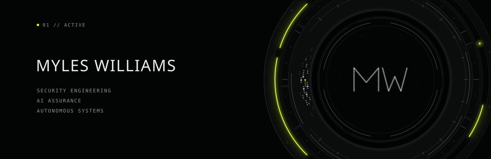
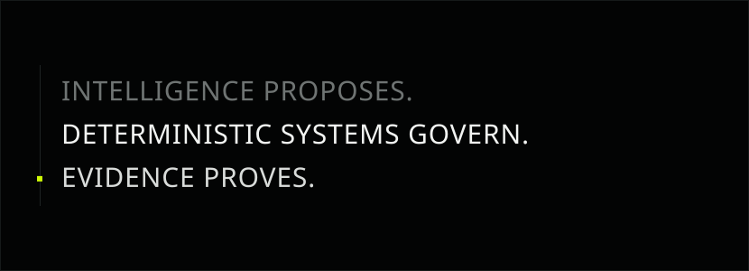

  

## 01 / Profile

**Engineering systems that remain accountable.**

I'm Myles Williams. I work in security engineering, with a particular interest in what happens when AI systems are given access to real tools, infrastructure and decisions.

My professional work covers security, cloud infrastructure and AI in regulated environments. Outside of that, I build things. Most recently, I've been building AI assurance tooling and experimenting with governed autonomous systems.

A lot of my work comes back to the same question: how much authority should we actually give intelligent software?

SECURITY ENGINEERING · AI ASSURANCE · AUTONOMOUS SYSTEMS

## 02 / Selected Work

### AI Assurance Gate

**Deterministic assurance for LLM, RAG and tool-enabled systems.**

A local-first framework for testing AI systems against explicit policies and producing reproducible evidence, without relying on LLM-as-judge. Built through HexaSec.

OPA/Rego · RAG · Tool governance · Signed evidence

Open source release planned for November 2026.

### KESTREL

**Governed autonomous systems research.**

KESTREL is a private autonomous systems research platform focused on systematic decision-making, deterministic risk controls and controlled execution.

Strategy and intelligence are kept separate from the parts of the system that actually have authority to approve risk or interact with external systems.

Event-driven systems · Risk authority · Controlled execution · Evidence

#### ORYS

An AI-assisted trading workstation combining analysis, preflight risk controls, auditable workflows and MetaTrader 5 execution. It also includes signed licence validation with an offline grace period.

Python · React · FastAPI · MT5

## 03 / Working Across

**Security** 
Cloud infrastructure, network security, detection engineering, identity and security architecture.

**AI systems** 
LLM/RAG architecture, AI assurance, evaluation, policy enforcement and governed tool use.

**Autonomous systems** 
Decision architecture, deterministic control, event-driven systems, risk authority and execution governance.

**Building with** 
Python · TypeScript · React · Next.js · FastAPI · Azure · OPA/Rego

## 04 / Operating Principle

  

## 05 / Writing

I write about AI assurance, security boundaries and the engineering problems that show up once intelligent systems are allowed to touch real infrastructure.

Currently working on:

- Why I Don't Let LLMs Judge Themselves
- Who Should Have Authority in an Autonomous System?

Writing will live at [myleswilliams.dev](https://myleswilliams.dev).

## 06 / Links

[Website](https://myleswilliams.dev) · [LinkedIn](https://www.linkedin.com/in/mylesjwilliams/) · [HexaSec](https://hexasec.co.uk)
