<p align="center">
  
</p>

<p align="center">
  <a href="https://myleswilliams.dev">myleswilliams.dev</a> &nbsp;·&nbsp;
  <a href="https://github.com/hexasec-ltd">HexaSec</a> &nbsp;·&nbsp;
  <a href="https://hexasec.co.uk">hexasec.co.uk</a>
</p>

---

### `00 / SYSTEM PROFILE`

I build **high-assurance systems** at the intersection of cybersecurity, artificial intelligence and autonomous decision-making.

My work focuses on a recurring problem: **how do we use probabilistic intelligence without surrendering authority, evidence or control?**

> ### Intelligence proposes.  
> ### Deterministic systems govern.  
> ### Evidence proves.

```text
CURRENT VECTOR

BUILDING      AI ASSURANCE GATE
RESEARCHING   KESTREL
WORKING IN    CYBERSECURITY + AI SECURITY
FOCUS         HIGH-ASSURANCE AUTONOMOUS SYSTEMS
```

---

### `01 / SELECTED SYSTEMS`

<table>
<tr>
<td width="50%" valign="top">

#### AI ASSURANCE GATE
**Deterministic release assurance for AI systems**

A local-first assurance system for evaluating LLM, RAG and tool-enabled systems using deterministic controls, policy-as-code and inspectable evidence.

`AI ASSURANCE` `OPA / REGO` `RAG` `EVIDENCE` `LOCAL-FIRST`

**Creator & Primary Maintainer**  
Owned by **HexaSec Ltd**

<sub>OPEN SOURCE RELEASE / IN PREPARATION</sub>

</td>
<td width="50%" valign="top">

#### KESTREL
**Governed autonomous quantitative research**

A private research platform exploring systematic decision-making and autonomous execution under deterministic risk and execution authority.

`QUANT RESEARCH` `AUTONOMOUS SYSTEMS` `RISK` `PYTHON`

```text
MARKET → STRATEGY → DECISION
              ↓
        RISK AUTHORITY
              ↓
      EXECUTION GATEWAY
              ↓
            BROKER
```

</td>
</tr>
<tr>
<td width="50%" valign="top">

#### ORYS
**AI-assisted trading workstation**

A desktop trading system combining market intelligence, risk controls, AI-assisted analysis, MT5 execution and auditable decision workflows.

`REACT` `PYTHON` `MT5` `AI` `AZURE`

</td>
<td width="50%" valign="top">

#### HEXASEC
**Cybersecurity & AI research**

Founder of HexaSec Ltd — building security and assurance technology for sensitive and regulated environments.

`AI SECURITY` `ASSURANCE` `LOCAL AI` `SECURITY ENGINEERING`

[hexasec.co.uk](https://hexasec.co.uk) · [github.com/hexasec-ltd](https://github.com/hexasec-ltd)

</td>
</tr>
</table>

---

### `02 / AUTHORITY MODEL`

```text
┌──────────────────────┐
│  INTELLIGENCE LAYER  │  proposes / predicts / recommends
└──────────┬───────────┘
           │
           ▼
┌──────────────────────┐
│ DETERMINISTIC CONTROL│  evaluates / constrains / authorises
└──────────┬───────────┘
           │
           ▼
┌──────────────────────┐
│   EVIDENCE LAYER     │  records / signs / proves
└──────────┬───────────┘
           │
           ▼
┌──────────────────────┐
│ CONTROLLED EXECUTION │  acts only within defined authority
└──────────────────────┘
```

This pattern appears repeatedly in my work — from AI release assurance to autonomous financial systems.

---

### `03 / ENGINEERING PRINCIPLES`

**01 — DETERMINISTIC > SUBJECTIVE**  
High-consequence decisions need controls that can be inspected, reproduced and challenged.

**02 — EVIDENCE > CLAIMS**  
A system should be capable of demonstrating what happened, why it happened and what authorised it.

**03 — AUTHORITY ≠ INTELLIGENCE**  
A component capable of reasoning does not automatically deserve permission to act.

**04 — LOCAL WHEN IT MATTERS**  
Sensitive workloads should not require unnecessary data exposure or external dependency.

**05 — FAIL CLOSED**  
Uncertainty should not silently become permission.

---

### `04 / RESEARCH VECTOR`

```text
AI SECURITY             ████████████████████  ACTIVE
AI ASSURANCE            ███████████████████░  ACTIVE
AUTONOMOUS SYSTEMS      ██████████████████░░  ACTIVE
QUANTITATIVE SYSTEMS    ███████████████░░░░░  RESEARCH
LOCAL / PRIVATE AI      ████████████░░░░░░░░  EXPLORING
```

<sub>These bars represent current research attention — not skill ratings.</sub>

---

### `05 / PROFESSIONAL`

**Network Security Manager · Ruleguard**

Security engineering · cloud security · AI infrastructure · AI assurance · regulated environments · ISO 27001 · ISO 42001

My professional work spans security architecture and operations through to private AI infrastructure and the governance of AI systems in regulated environments.

---

### `06 / SYSTEMS & TOOLING`

| Domain | Working set |
|---|---|
| **Systems** | Python · FastAPI · React · Next.js · TypeScript |
| **AI** | LLM infrastructure · RAG · embeddings · vLLM · local inference |
| **Security** | OPA/Rego · Azure · CrowdStrike · Zscaler · Microsoft Entra |
| **Platform** | Docker · GitHub Actions · Vercel · PostgreSQL |
| **Research** | MT5 · quantitative experimentation · deterministic evaluation |

---

### `07 / WRITING`

Technical notes and long-form writing will live at **[myleswilliams.dev](https://myleswilliams.dev)**.

Planned research notes include:

- **Why I Don't Let LLMs Judge Themselves** — deterministic assurance for high-consequence AI systems
- **Who Should Have Authority in an Autonomous System?** — separating intelligence, policy and execution

---

### `08 / NETWORK`

```text
MYLES WILLIAMS
      │
      ├── HEXASEC LTD ───── AI ASSURANCE GATE
      │
      ├── KESTREL ───────── AUTONOMOUS SYSTEMS RESEARCH
      │
      └── ORYS ──────────── AI-ASSISTED TRADING SYSTEMS
```

**Web** — [myleswilliams.dev](https://myleswilliams.dev)  
**GitHub** — [github.com/myles-williams](https://github.com/myles-williams)  
**HexaSec** — [hexasec.co.uk](https://hexasec.co.uk)

<p align="center">
  
</p>
